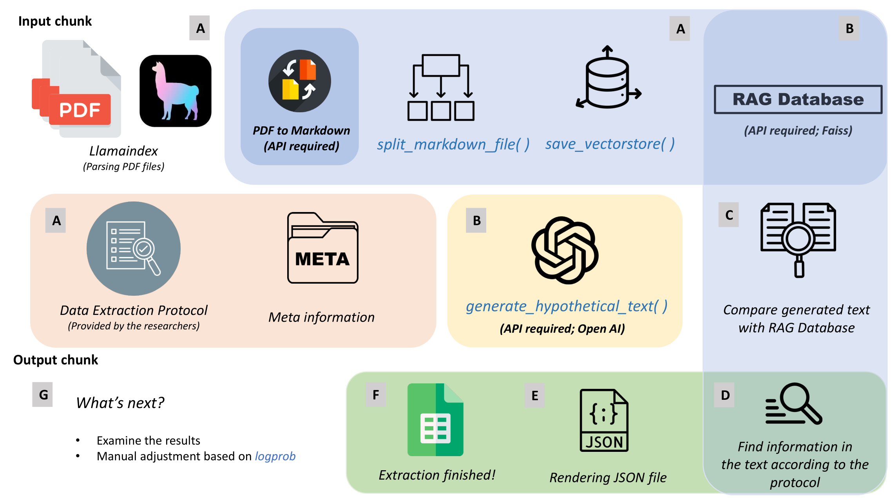

# LLMeta


[](https://pypi.org/project/LLMeta/)
[](https://jinquanyescholar.netlify.app)
[](https://ziqian-xia.tech/)
[](https://x.com/yebarryallen)
[](https://x.com/Ziqian_Xia)




LLMeta is a Python package designed for conducting systematic reviews using large language models in conjunction with Retrieval Augmented Generation (RAG) and Hypothetical Document Embeddings (HyDE) techniques.

## Installation

To install LLMeta, you can use pip:

```bash
pip install LLMeta
```
